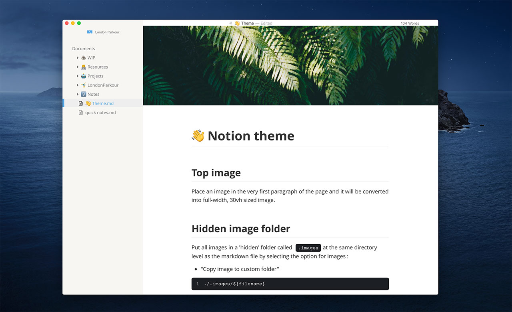
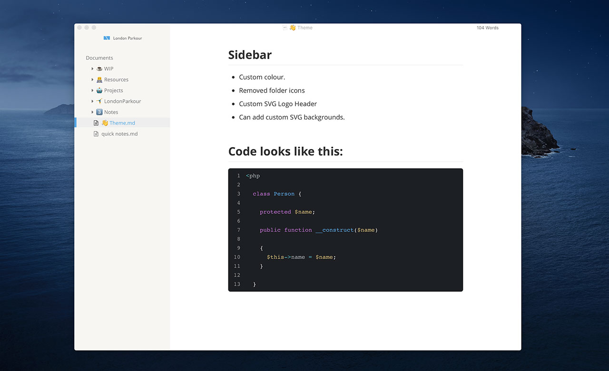

# Typora theme - Notion.so

My little attempt at recreating the notion.so theme and functionality through pure CSS themes.

## Main feature - Top image full width image

Place an image in the very first paragraph of the page and it will be converted into a full-width, 30vh sized image across the top of the page. 
The image is aligned top-center. and the rest will be cropped. You can change this to be center-center in the CSS.


## Hidden image folder

Put all images in a 'hidden' folder called `.images`at the same directory level as the markdown file by selecting the option for images :  ''Copy image to custom folder"

```
./.images/${filename}
```

## Embedded Header Logo

I have my own logo embedded in the sidebar at the top as an SVG. Replace the SVG for your own.

## Sidebar

- Custom Notion.so colour.
- Removed folder icons
- Can add custom SVG backgrounds. - I've included a commented-out SVG background for the sidebar too. You can uncomment it to have patterns.


## Codes

Is similar to a dark 'Monokai' theme for VSCode.

